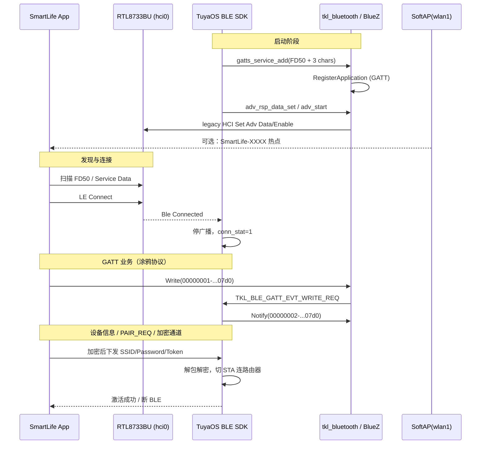

# ATK-DLRK3506B 蓝牙配网：流程、问题清单与注意事项

> 平台：ATK-DLRK3506B（RK3506 + RTL8733BU USB WiFi/BT）  
> 模块：TuyaOS BLE 配网（与 SoftAP 可并存）  
> 适配层路径：`vendor/.../tuyaos/tuyaos_adapter/src/`  
> 相关提交：`005a6ed`（GATT UUID / legacy ADV / Write 长度）  
> SoftAP 侧另见：`SOFTAP_AP_PROVISIONING_NOTES.md`

---

## 一、整体架构（当前落地方案）

```
手机 SmartLife App
        │
        ├─ BLE 扫描 (Service UUID FD50 + Service Data)
        ├─ GATT 连接 / 写特征 / Notify
        └─ （可选）连 SoftAP SmartLife-xxxx 传 Wi‑Fi 凭据
                │
设备侧 TuyaOS SDK (libtuyaos)
                │ TKL API
                ▼
        tkl_bluetooth.c
                │
        tuya_bluez_api.c
           ├─ 广播：raw legacy HCI（tuya_hci.c）──► 控制器真正发包
           └─ GATT：BlueZ D-Bus GattManager1（tuya_gatt.c + bluetoothd）
```

要点：

| 能力 | 实现路径 | 说明 |
|------|----------|------|
| LE 广播 | **raw HCI**（`LE Set Adv Params/Data/Enable`） | BlueZ `LEAdvertisingManager1` 在本芯片上常「注册成功但不空口发包」 |
| GATT Server | BlueZ D-Bus `GattManager1` + `RegisterApplication` | 提供 FD50 服务与写/通知/读特征 |
| SoftAP | `wlan1` + hostapd | 与 BLE 可并存；本工程主配网入口常为 `WF_START_AP_ONLY`，但 BLE 仍可作发现/传参通道 |

**不要**同时让 BlueZ 再 `RegisterAdvertisement`：会占用 MGMT 广播，导致 raw HCI 返回 `0x0C Command Disallowed`。

---

## 二、蓝牙配网完整流程

### 2.1 时序（设备侧）



### 2.2 分阶段说明

1. **栈与服务就绪**  
   - `dbus-daemon`、`bluetoothd`、`hci0 UP`  
   - `tuya_bluez_init()` → `tuya_gatt_init()` → `RegisterApplication`  
   - SDK 注册 Service `0xFD50` 及三个特征  

2. **广播**  
   - SDK：`start ble adv!!!` / `ble adv updated`  
   - 适配层：`hci: LE Set Adv Enable ... OK`（才表示射频侧真正打开）  
   - 广播内容需含 Flags、Service UUID `FD50`、Service Data（PID/状态等），并控制在 **legacy 31 字节**内  

3. **连接**  
   - 内核/驱动：`rtk_btcoex: LE connected`  
   - SDK：`Ble Connected`，随后通常停广播  

4. **GATT 交互**  
   - App 写 Write 特征 → SDK `Parse BT Cmd`  
   - 典型：`0x0` 设备信息、`0x1` `PAIR_REQ`  
   - Notify 回包；随后进入加密包（SSID 等，长度常 >255）  

5. **配网上云**  
   - SDK 用凭据连路由器（或配合 SoftAP）→ 激活  
   - 断连后需能再次 `adv_start`，否则 App「再次扫描」会失败  

### 2.3 官方 GATT UUID（必须一致）

| 角色 | UUID |
|------|------|
| Service | `0xFD50`（`0000fd50-0000-1000-8000-00805f9b34fb`） |
| Write | `00000001-0000-1001-8001-00805f9b07d0` |
| Notify | `00000002-0000-1001-8001-00805f9b07d0` |
| Read | `00000003-0000-1001-8001-00805f9b07d0` |

Notify 特征需带 CCCD `0x2902`，否则部分手机走不通 `StartNotify`。

---

## 三、出现过的问题（按序号）

### 1. `start ble adv!!!` 不等于手机能扫到

- **现象**：日志有 `start ble adv!!!` / `ble adv updated`，App/nRF 扫不到。  
- **原因**：SDK 只发起请求；适配层/BlueZ/控制器任一层失败仍可能返回上层成功。  
- **处理**：以 `hci: LE Set Adv Enable status=0x00`、nRF 能看到 `FD50` 为准。

### 2. OverlayFS 盖掉 `/var/lib/dbus`，`machine-id` 创建失败

- **现象**：`Could not create /var/lib/dbus/machine-id`；D-Bus/BlueZ 异常。  
- **原因**：`S01overlayfs` 用空的 `/userdata/overlay/var/lib` bind 覆盖 `/var/lib`。  
- **处理**：bind 后预创建 `/var/lib/dbus`；`dbus-uuidgen --ensure`。

### 3. `S39btattach` 按 UART `ttyS5` 设计，与 USB `rtk_btusb` 冲突

- **现象**：`btattach FAIL (/dev/ttyS5 missing)`；错误复位导致 `hci0` DOWN、`Opcode 0x0c03 failed: -110`。  
- **原因**：本板蓝牙是 USB，不是 UART HCI。  
- **处理**：禁止对 USB 控制器乱 `btattach`/Reset。**注意**：早期版本在这里做 `hciconfig hci0 up`，
  已经删掉——见问题 15。

### 4. `bluetoothd` 重启 FAIL（残留 pid）

- **现象**：`killall bluetoothd` 后 `S40bluetoothd start` 报 FAIL。  
- **原因**：`/var/run/bluetoothd.pid` 残留，`start-stop-daemon` 以为仍在运行。  
- **处理**：删 pid 再启；确认 `dbus-daemon` 仍在。

### 5. BlueZ `RegisterAdvertisement: OK` 但不空口发包

- **现象**：D-Bus 注册成功、`ActiveInstances` 有值，手机仍扫不到或极不稳定。  
- **原因**：RTL8733BU + BlueZ Extended/MGMT 广播路径在本平台不可靠。  
- **处理**：广播改走 **raw legacy HCI**；BlueZ 侧不要再 RegisterAdvertisement。

### 6. Extended ADV / legacy 广播约 2s 后停、间隔过慢

- **现象**：偶发可见、很快消失，或难扫到。  
- **原因**：两件事叠加，都在内核侧：  
  1. `hci_schedule_adv_instance_sync()` 对「单实例 + unlimited」也按
     `HCI_DEFAULT_ADV_DURATION`（2s）挂了轮转定时器，`adv_instance_expire`
     到点就把 `LE Set Adv Enable` 关掉——所以 `RegisterAdvertisement` 返回 OK、
     `ActiveInstances` 有值，但两秒后就没了。  
  2. legacy `MGMT_OP_ADD_ADVERTISING` 忽略 BlueZ 的 MinInterval，默认 1.28s，
     手机要很久才发现。  
- **处理**：内核补丁——单实例 unlimited 不再挂 expire；`HCI_QUIRK_BROKEN_EXT_ADV`
  同时把间隔设成 100/120ms。  
- **注意**：曾经还有一个 buildroot 补丁
  `package/bluez5_utils/0002-force-legacy-le-advertising.patch`
  （强制 `manager->extended_add_cmds = false`）。**已删除**：它改的是
  `src/advertising.c` 的 `manager_create()`，只有走 D-Bus `RegisterAdvertisement`
  才会执行到；而本工程广播全部走 raw HCI，全链路无人调用它
  （S41 里出现的 `LEAdvertisingManager1` 只是 Introspect 探测「栈是否就绪」，
  并不注册广播）。留着就是每次 BlueZ 升版都要 rebase 一个不生效的补丁。  
  **如果哪天把广播改回 BlueZ D-Bus 路径，需要把这个补丁加回来**，
  否则 BlueZ 会重新走 extended adv。

### 7. Legacy ADV 31 字节超限

- **现象**：设广播数据失败或字段被截断，App 按 Service Data 过滤不到设备。  
- **原因**：同时塞 ManufacturerData + ServiceData + UUID 等易超 31。  
- **处理**：优先保留 Flags + FD50 + ServiceData；丢掉可省的 ManufacturerData。

### 8. SoftAP RF 与 BLE 互斥（曾误关 SoftAP）

- **现象**：为「让 BLE 好扫」暂停 SoftAP 后，热点配网不可用。  
- **原因**：RTL8733BU 上 SoftAP+BLE 可并存；错误暂停破坏双通道。  
- **处理**：不要为 BLE 关掉 SoftAP；双通道并行。

### 9. 烧录未真正更新 rootfs 里的应用

- **现象**：改了代码、打了 `update.img`，板上仍是旧行为；`USER_SW_VER` 一直显示 `1.0.76`。  
- **原因**：只拷二进制到 overlay/target，未重打 squashfs；或只看了硬编码版本号。  
- **处理**：必须 `./build.sh buildroot` 再 `firmware`/`updateimg`；用 `/etc/wukong_ai_build` 或二进制 MD5 确认，不单靠 `1.0.76` 字符串。

### 10. GATT 特征 UUID 全部错成 `07d0`（蓝牙标准基）

- **现象**：能 `Ble Connected`，但无写、无 `StartNotify`，约 30s 后 `device no permit to connect, disconnect!!`。  
- **原因**：128-bit UUID 小端末两字节是公司后缀 `07d0`，误当成短 UUID，再展开成 `000007d0-0000-1000-8000-00805f9b34fb`。  
- **处理**：按官方发布 `00000001/02/03-0000-1001-8001-00805f9b07d0`；handle 用 time_low 的 `0x0001/2/3`。

### 11. Write 长度被压成 `uint8_t`（MTU>255 截断）

- **现象**：`PAIR_REQ ok` 后出现 `ble_data_unpack err:-2`、`ble recv data decrypt err:1`，`pack_len:0`。  
- **原因**：`WriteValue` 回调 `(uint8_t)len`，ATT MTU 协商到约 512 后大包被截断。  
- **处理**：全程使用 `uint16_t` 长度传到 SDK。

### 12. 连接后再次「扫不到」

- **现象**：连过一次后 App 再扫不到。  
- **原因**：连接后控制器停广播；断连后若 `adv_enable` 失败（如 `0x0C`）或未再 `adv_start`，则不可见。  
- **处理**：确认断连后再次 `LE Set Adv Enable OK`；排查看 BlueZ 是否又占用了 ADV。

### 13. 配网模式与 App 发现预期不一致

- **现象**：射频正常，涂鸦 App 仍「扫不到设备」。  
- **原因**：工程常为 SoftAP 主路径；App 发现逻辑依赖 Service Data/产品维度；仅开蓝牙扫描可能不展示。  
- **处理**：nRF 验证射频；App 侧可同时用 SoftAP `SmartLife-XXXX`；确认广播 Service Data 内容。

### 14. 抓包空 ATT（操作顺序问题）

- **现象**：`btmon` 无 ATT。  
- **原因**：抓包期间未真正发起 App 配网，或抓完才连。  
- **处理**：先开 `btmon`，再在 App 里点添加/连接，结束后再停。

### 15. 开机到「手机能扫到」太慢（约 20~30s 纯 sleep）

- **现象**：上电后要等很久 App 才扫得到设备，串口上 `S39`/`S41` 阶段肉眼可见地卡住。  
- **原因**（三层叠加）：  
  1. `S39btattach` 做了 `hciconfig hci0 up`，而 `S41ble_ready` 要求 bluetoothd 启动时 `hci0` 必须是 DOWN
     （mgmt 拥有 power-up 权）。于是 S39 做的事全被 S41 推翻，还把 S41 的 round1 逼成
     「先 USB rebind」——unbind/bind + 重新下载一次固件，每次开机都白花好几秒。  
  2. 两个脚本里全是固定 `sleep 1/2/3`，成功路径上无条件睡掉 ≥20s；轮询粒度也是 1s。  
  3. S39/S41 同步阻塞 rcS，而这段时间几乎全是等硬件，本可以和后面的 init 并行。  
- **处理**：  
  - S39 不再 `hciconfig up`，只负责把 bring-up **后台**拉起来（`S41ble_ready bringup &`）；  
  - S41 的 round1 改成 plain mgmt 路径，USB rebind 降级为失败兜底（round2）；  
  - 所有固定 sleep 换成 50/100/200ms 轮询（用 `usleep`，busybox 的 `sleep` 没编 float 支持，
    写 `sleep 0.05` 会直接报错变成忙等）；  
  - `S98wukong_ai` 起 app 前用 `S41ble_ready wait` 等 `/var/run/ble_ready.done`，正常情况下瞬间返回。  
- **排查**：`grep -E 'adapter|PRESENT|try |wait:' /var/log/ble_boot.log`，每行都带 ms 耗时。

---

## 四、需要注意的问题（运维 / 开发检查清单）

1. **HCI 形态**：本板是 **USB `rtk_btusb` → hci0**，不是 UART `ttyS5`。  
2. **依赖进程顺序**：`dbus-daemon` → `bluetoothd` → `hci0 up` → 应用。缺一则 GATT/广播异常。  
3. **广播与 GATT 分工**：广播走 raw HCI；GATT 走 BlueZ；二者不要抢 ADV。  
4. **UUID 禁止「从 128-bit 尾部取 16 位」**：尾部 `07d0` 不是特征 ID。  
5. **长度类型**：GATT Write/Notify 路径禁止 `uint8_t len`。  
6. **CCCD**：Notify 必须挂 `0x2902`。  
7. **legacy 31 字节**：改广播字段前先算长度。  
8. **SoftAP 与 BLE 并存**：不要为 BLE「优化」误杀 SoftAP。  
9. **版本确认**：用 `/etc/wukong_ai_build` / 文件 MD5，不要只看日志里的 `name:...:1.0.76`。  
   部署一律走 `buildroot/board/alientek/atk-dlrk3506/deploy-wukong-app.sh`，
   别手工 `cp` 二进制进 overlay——手工拷过一次而忘了改版本戳，结果戳写 1.0.86、
   板上实际跑 1.0.87，反而把排查带偏。脚本把两件事绑在一起做。  
10. **打包链路**：改 app 后务必重建 rootfs 再打 `update.img`。  
11. **内核/BlueZ 补丁**：legacy ADV 相关补丁在 **buildroot/kernel**，不在 app 仓库；换 SDK 包时要单独同步。  
12. **凭据**：`UUID`/`AUTHKEY` 勿提交到 git；与 BLE 适配代码分开管理。  
13. **调试优先级**：先 nRF 能否扫到 → 再看 `Ble Connected` → 再看 `WriteValue`/`recv write`/`PAIR_REQ` → 再看 decrypt。  
14. **临时兜底**：BLE 异常时仍可用 SoftAP `SmartLife-XXXX` 完成配网。

---

## 五、板上快速诊断命令

```sh
# 1) 版本 / HCI
cat /etc/wukong_ai_build
hciconfig -a
ps | grep -E 'dbus-daemon|bluetoothd|wukong' | grep -v grep

# 2) 关键日志
grep -E 'RegisterApplication|hci: LE Set Adv|chr\[|WriteValue|recv write|Ble Connected|PAIR_REQ|decrypt|unpack' \
  /var/log/wukong_ai.log | tail -80

# 3) SoftAP
iwconfig 2>/dev/null | head
# 期望热点名类似 SmartLife-4F73
```

期望正常时：

- `hci0`：`UP RUNNING`，地址非全 0  
- `RegisterApplication: OK`  
- `hci: LE Set Adv Enable ... OK`  
- 特征日志为 `00000001/02/03-...00805f9b07d0`  
- 配网时有 `recv write request ... len:`（可大于 255），无 `decrypt err`

---

## 六、关键源码与系统文件

| 类别 | 路径 |
|------|------|
| TKL 入口 | `tuyaos_adapter/src/tkl_bluetooth.c` |
| BlueZ 封装 | `tuyaos_adapter/src/tuya_bluez_api.c` |
| GATT | `tuyaos_adapter/src/tuya_gatt.c` |
| Raw HCI 广播 | `tuyaos_adapter/src/tuya_hci.c` |
| BlueZ ADV | 已删除（原 `tuya_adv.c/.h`）。广播固定走 raw HCI，`LEAdvertisingManager1` 路径无人调用 |
| 启动 / overlay | `buildroot/.../fs-overlay/etc/init.d/S01overlayfs`、`S39btattach`、`S40bluetoothd`、`S41ble_ready`、`S98wukong_ai` |
| BlueZ legacy 补丁 | 已删除，理由见问题 6 |
| 内核 ADV 相关 | `kernel-6.1/net/bluetooth/hci_sync.c`、`hci_event.c`、`include/net/bluetooth/hci.h`（`HCI_QUIRK_BROKEN_EXT_ADV`）、`drivers/bluetooth/bluetooth_usb_driver/rtk_bt.c`（置位处） |
| App 部署 / 版本戳 | `buildroot/board/alientek/atk-dlrk3506/deploy-wukong-app.sh` — 拷二进制和写 `/etc/wukong_ai_build` 必须一起做，见注意事项 9 |

---

## 七、与 SoftAP 文档的关系

- SoftAP 问题与优化：见 `SOFTAP_AP_PROVISIONING_NOTES.md`。  
- 产品策略上可 **SoftAP 为主、BLE 为辅**；BLE 用于发现与传参时，仍须满足本文 UUID/广播/长度约束。  
- 两通道在 RTL8733BU 上应可同时工作；任一侧异常不要用「关掉另一侧」当作默认方案。

---

*整理自 ATK-DLRK3506B Wukong AI 蓝牙配网适配过程（约 2026-07）。后续若 ADV 策略改回 BlueZ D-Bus 或 UUID/MTU 行为变化，请同步更新本文。*
